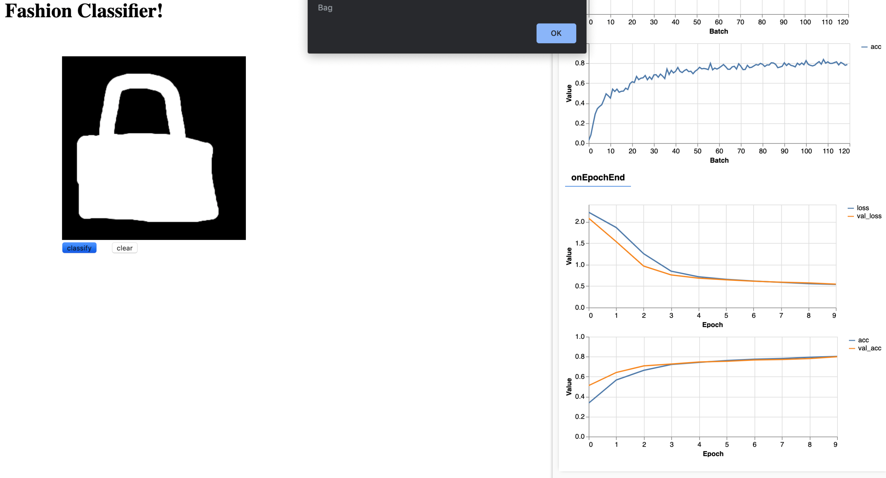
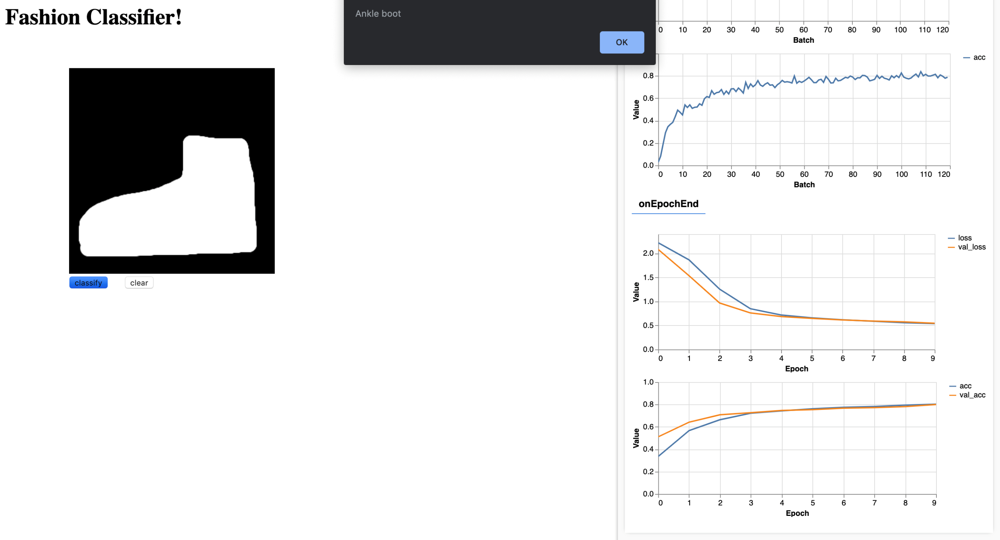
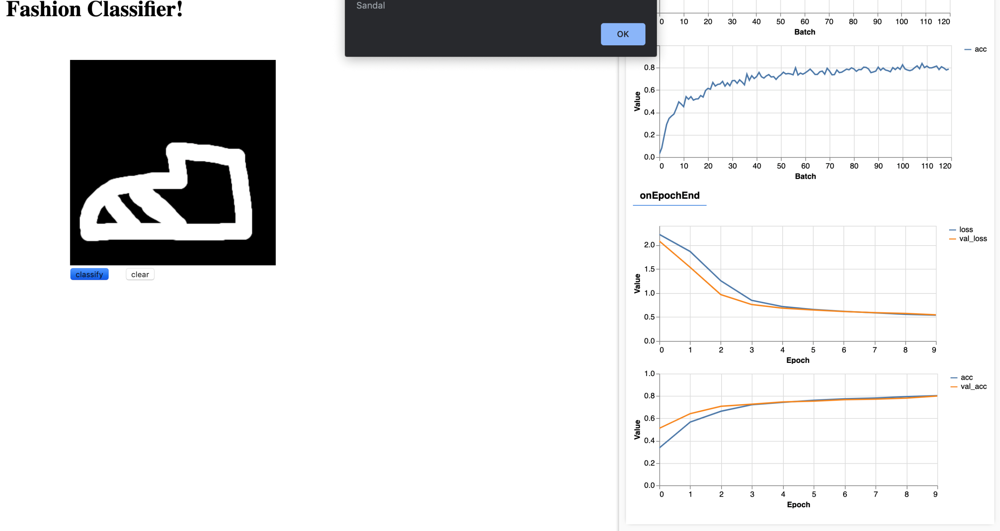

# Fashion-Mnist-Using-CNN-TensorFlowJS

Fashion Mnist Image Classification Using Convolutional Neural Networks (TensorFlowJS)

https://habiburrahman-mu.github.io/works/Fashion-Mnist-Using-CNN-TensorFlowJS/fashion-mnist.html

I build a simple convoluation neural network using tensorflow-js to classify Fashion-MNIST dataset.

The training set consists of 60k examples and test set consists of 10k examples. Each example is a 28x28 grayscale image, 
associated with a label from 10 classes as mentioned below. 

0 -> T-shirt  
1 -> Trouser  
2 -> Pullover  
3 -> Dress  
4 -> Coat  
5 -> Sandal  
6 -> Shirt  
7 -> Sneaker  
8 -> Bag  
9 -> Ankle boot  

Once training has finished, you can draw any of the 10 articles of clothing from the Fashion MNIST dataset on the black rectangle to be classified. After drawing an article of clothing, and pressing the "classify" button, the code will alert the predicted article of clothing. Below are some examples:

1.In this example, the predicted article of clothing is a Bag.

2.In this example, the predicted article of clothing is an Ankle Boot.

3.In this example, the predicted article of clothing is a Sandal.

